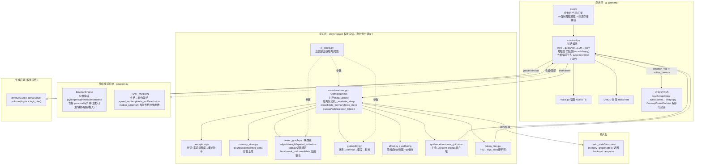
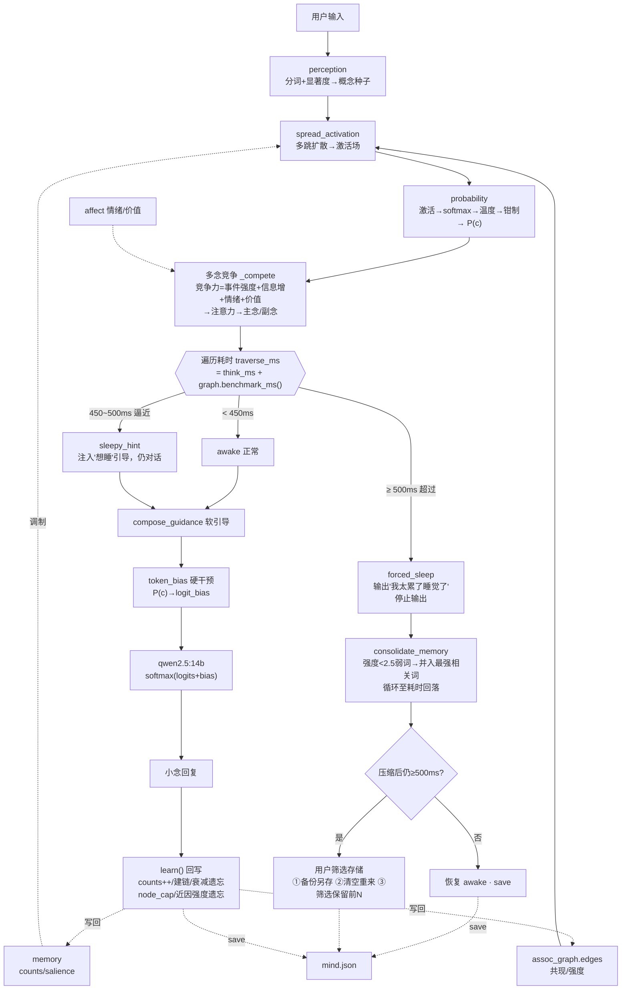
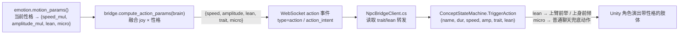

# 小念·意识层 架构图与数据流图

> 本文档覆盖小念（ai-girlfriend 本地版）意识层的整体架构、一次对话的完整数据流，
> 以及五道遗忘/自愈保险（含性能触发的「睡眠 / 记忆压缩整合」）。
> qwen 权重全程冻结，意识层只作用于**解码期的提示词软引导 + logit_bias 硬干预**两条通道。

---

## 一、架构图（分层 + 模块职责）

---

## 二、数据流图（一次对话全链路 + 睡眠保险）

---

## 三、五道遗忘 / 自愈保险一览

| # | 保险 | 触发条件 | 作用 | 归属 |
|---|---|---|---|---|
| 1 | `mem.tick` 逐轮衰减 | 每轮 | 关联边 ×0.997，弱边删 | 旧 |
| 2 | `enforce_node_cap` 全局封顶 | 节点 > 60000 | 删最冷门概念+边 | 旧 |
| 3 | `link` 清边 | 回写 | 清孤立边 | 旧 |
| 4 | `decay_strength_by_recency` 近因遗忘 | 闲置 > 8 轮 | 强度 ×0.992 → <0.5 遗忘 | 前次新增 |
| 5 | **睡眠 / 压缩整合** | **遍历耗时 ≥ 500ms** | **弱词并入强词，耗时不降则交用户筛选** | **本次新增** |

**核心逻辑**：前 4 道「细水长流」地删边 / 删冷词、控制记忆图不无限膨胀；第 5 道是**性能兜底**——当记忆图涨到「每轮遍历逼近 500ms」（越聊越慢的真正来源），小念先犯困提醒、再强制睡眠，把「快归零的弱词」整合进「最强相关词」（信息不丢、并入相关新词），实在压不下去才让用户决定备份 / 清空 / 筛选。

---

## 四、睡眠机制关键旋钮（`clayer/cl_config.py`）

| 旋钮 | 默认值 | 含义 |
|---|---|---|
| `SLEEP_WARN_MS` | 450 | 逼近阈值 → 犯困态，向用户表达想睡 |
| `SLEEP_FORCE_MS` | 500 | 超过阈值 → 强制睡眠：停输出 + 压缩整合 |
| `SLEEP_RECOVER_MS` | 360 | 回落到此以下才解除睡眠态 |
| `SLEEP_COST_K` | 1.0 | benchmark_ms 标定系数（越大越早触发） |
| `CONSOLIDATE_STRENGTH_MAX` | 2.5 | 强度低于此的弱词优先并入最强相关词 |
| `CONSOLIDATE_BATCH` | 200 | 单次强制睡眠最多合并的弱词数 |
| `SLEEP_CONSOLIDATE_MAX_STEPS` | 30 | 压缩整合最多迭代轮数 |

---

## 五、情绪情感系统与动作下发链路（性格 × 情感 → Unity）

小念的肢体演出不是固定循环，而是由 **情绪（`joy` 兴奋度）× 性格（5 种）** 实时融合驱动。

### 5.1 两个维度

- **情绪（情感）**：`emotion.py` 维护 5 维（joy/anger/sadness/calm/anxiety），`joy` 作为“兴奋度”直接调制动作速度/幅度。
- **性格**：由情绪长期累计差值派生（`personality["trait"]` ∈ {温柔平静, 活泼开心, 傲娇小脾气, 敏感爱哭, 黏人紧张}），**只改演出风格，不改底层目的**。

### 5.2 `TRAIT_MOTION`（性格 → 动作偏好）

| 性格 | speed_mul | amplitude_mul | lean（身体倾向） | micro（招牌动作） |
|---|---|---|---|---|
| 温柔平静 | 0.82 | 0.85 | -0.05 | — |
| 活泼开心 | 1.18 | 1.12 | +0.10 | ACT_WAVE |
| 傲娇小脾气 | 1.08 | 0.95 | -0.12 | ACT_TURN |
| 敏感爱哭 | 0.75 | 0.78 | -0.15 | — |
| 黏人紧张 | 0.92 | 0.88 | +0.18 | ACT_FOLLOW |

### 5.3 端到端数据流

- **Python 侧**：`assistant.py` 取 `emotion.dominant()`（主导情绪）注入表情；`bridge.compute_action_params()` 把 `joy`（情感）× `TRAIT_MOTION`（性格）融合成 `speed/amplitude/lean/trait/micro`，4 个动作下发点（即时反馈 / 说话 on_play / 无 TTS / 自发 action_intent）统一走它。
- **Unity 侧**：`NpcBridgeClient` 转发 `trait`/`lean`；`ConceptStateMachine.TriggerAction` 把 `lean` 折算进骨骼（挥手时上臂前举、点头时上身前倾），`micro` 影响普通聊天的兜底动作（黏人→靠近、傲娇→别过脸）。

---

## 六、数据 + 截屏联合理（屏幕陪伴双通道）

屏幕陪伴用 **程序级 + 像素级** 双通道，由 `bridge.py` 的 `_handle_visual_snapshot` 联合：

1. **程序级（symbolic）**：`world_state.py` / `screen_watch.py` 拿前台窗口标题、进程名、连续使用时长，构成结构化事实（“在玩原神 / 已玩 40 分钟”）。
2. **像素级（vision）**：`vision.describe_screen()` 截图后用视觉模型（如 GLM-4V）理解画面内容（输赢 / 升级 / 报错弹窗文字 / 视频封面）。
3. **联合注入**：两者拼成同一段上下文喂给 LLM，让小念既能“程序级感知在用什么软件”，又能“像素级看懂画面发生了什么”，且不依赖单一通道。

> 视觉默认关闭（`VISION_ENABLED=false`），需自备视觉 API Key；程序级感知无需任何模型即可工作。

