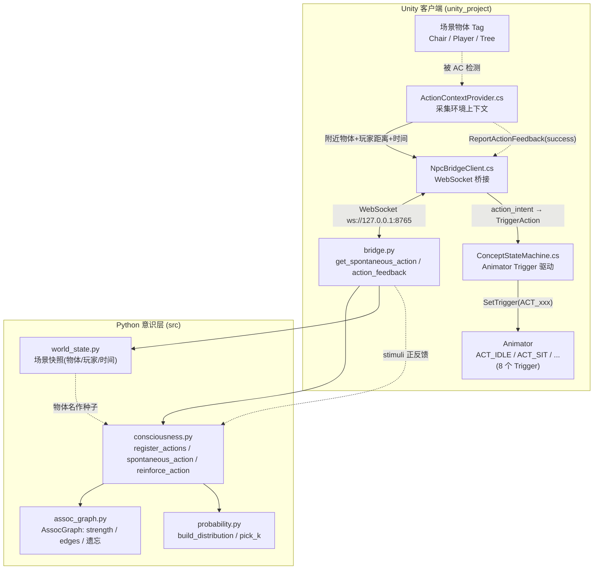
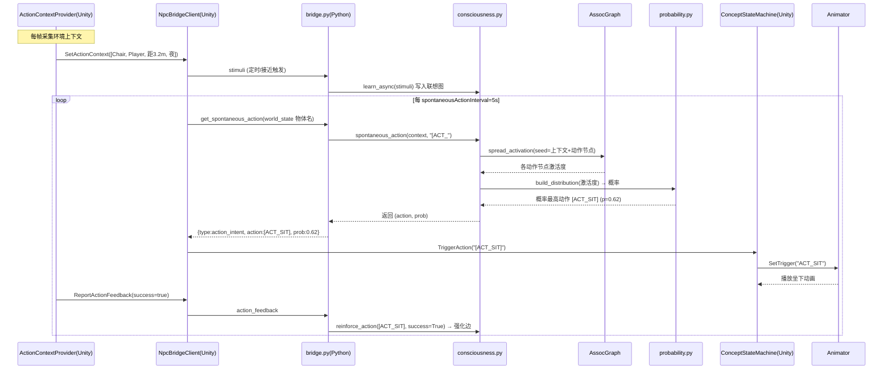

# 小念「记忆-动作闭环」：让 NPC 不依赖 LLM 自主运动

> 本文档总结本次为本地版（Unity + Python 意识层）新增的 **NPC 自主运动子系统**：
> 通过把动画状态注册成概念节点、用环境上下文驱动扩散激活、遗忘曲线筛选高频动作、
> 执行失败负反馈降权，实现**完全不调用大模型、毫秒级出意图**的自发肢体行为。

---

## 一、为什么做这套闭环

早期 NPC 只能被动等玩家聊天才有反应，且每次对话都打到本地 Ollama（14b 模型 + GPT-SoVITS 占显存），
机箱咆哮、首条回复要等 2~3 分钟。用户的核心诉求是：**「我要的是她能自主运动」**——

- 不依赖 LLM 推理速度，NPC 自己会坐、会看、会挥手、会跟玩家走；
- 行为要"有记忆"：常做的动作更常被触发，失败的动作为什么不再做；
- 行为要"看环境"：附近有椅子才想坐，玩家靠近才挥手/跟随。

这正是"记忆-动作闭环"要解决的：把**动画状态机**与**联想记忆图**打通。

---

## 二、系统架构图



**关键解耦**：整条自主动作链路（绿框内）**不经过 LLM**，只在 Python 侧做图计算，
因此延迟在毫秒级，且不占用 Ollama 的显存与队列。

---

## 三、数据流图（一次自发动作的生命周期）



**遗忘曲线**：每个动作节点强度每轮 ×0.992 衰减，`last_active` 刷新可避免被淘汰；
只有长期高频成功的动作才会沉淀为高概率候选。

**负反馈**：若动作执行失败（如 `ReportActionFeedback(false)`），
`reinforce_action(success=False)` 会把对应边权重 ×0.5（调用 `assoc_graph.weaken`），
该动作后续被选中概率下降。

---

## 四、动作节点与 Animator Trigger 映射

| 概念节点（意识层） | Animator Trigger | 典型触发上下文 |
|---|---|---|
| `[ACT_IDLE]` | `ACT_IDLE` | 默认兜底 |
| `[ACT_LOOKAROUND]` | `ACT_LOOKAROUND` | 环境变化、无目标 |
| `[ACT_WAVE]` | `ACT_WAVE` | 玩家接近 |
| `[ACT_SIT]` | `ACT_SIT` | 附近有 `Chair` Tag |
| `[ACT_WALK]` | `ACT_WALK` | 无目标漫游 |
| `[ACT_FOLLOW]` | `ACT_FOLLOW` | 玩家在附近 |
| `[ACT_RUN]` | `ACT_RUN` | 高兴奋/远离 |
| `[ACT_POINT]` | `ACT_POINT` | 指向物体 |

> **本次修复的关键 bug**：`ConceptStateMachine.TriggerAction` 原先对 `[ACT_IDLE]` 调 `Sanitize()`
> 会变成小写 `actidle`，与 Animator 里建的 `ACT_IDLE` 对不上 → 动作静默失败。
> 现已改为：识别 `[ACT_...]` 格式后直接提取 `ACT_xxx` 作为 Trigger 名（保留大小写）。

---

## 五、本次改动清单

### Python 侧（src/）
- `bridge.py`：新增 `get_spontaneous_action` / `action_feedback` 协议；`DEFAULT_ACTIONS` 注册 8 个动作；
  `spawn_npc` 时调 `mind.register_actions`；`stimuli` 事件同时驱动 `learn_async`。
- `clayer/consciousness.py`：新增 `register_actions` / `spontaneous_action` / `reinforce_action`
  （种子能量 + 显著度做扩散激活，筛选前缀 `[ACT_` 的最高概率动作；成功 link 强化、失败 weaken 降权）。
- `clayer/assoc_graph.py`：新增 `weaken(a,b,amount)`，低于阈值删边。
- `world_state.py`：场景快照新增可识别物体名（供作额外种子）。
- `assistant.py`：接入意识层自发动作与反馈回调。

### Unity C# 桥（unity_client/）
- `NpcBridgeClient.cs`：新增 `spontaneousActionInterval`、`SetActionContext`、
  `RequestSpontaneousAction`、`ReportActionFeedback`、公开 `onActionIntent` 事件；
  `case "action_intent"` 解析后调 `stateMachine.TriggerAction`。
- 新增 `BridgeHub.cs` / `NpcAgent.cs` / `NpcManager.cs` / `QuestSystem.cs` / `TownLayout.cs` 等小镇联机支持。

### Unity 脚本（unity_project/Assets/Scripts/）
- `ConceptStateMachine.cs`：修复动作 Trigger 名映射（见第四节 bug）。
- `ActionContextProvider.cs`（新建示例）：检测附近 `Chair/Player/Tree` Tag、玩家距离、时间，驱动上下文。
- `NpcBridgeClient.cs`：定时请求自发动作、上下文上报、反馈上报。
- `PlayerChatController.cs`：聊天发送加 Debug 日志。
- `ProjectSettings/TagManager.asset`：注册 `Chair` / `Player` / `Tree` 三个 Tag。

### Unity 编辑器需手动完成（资产无法文本安全生成）
1. 给小念 Animator Controller 建 8 个 **Trigger** 参数：`ACT_IDLE / ACT_LOOKAROUND / ACT_WAVE / ACT_SIT / ACT_WALK / ACT_FOLLOW / ACT_RUN / ACT_POINT`（名字大小写敏感，必须与表一致）。
2. 场景物体打 Tag：椅子→`Chair`，玩家→`Player`，树→`Tree`。
3. 给挂了 `ActionContextProvider` + `NpcBridgeClient` + `ConceptStateMachine` 的 NPC 进入 Play 模式验证：
   Console 每 ~5s 出现 `action_intent: [ACT_xxx]`，附近有 `Chair` 倾向 `[ACT_SIT]`、有 `Player` 倾向 `[ACT_FOLLOW]`/`[ACT_WAVE]`，且无 `actidle doesn't exist` 报错。

---

## 六、自检发现并修复的 3 个闭环 bug（实测抓出）

> 把项目"跑一遍"（无头冒烟测试 `_smoke_actions.py`，隔离验证图计算全链路，不依赖 Ollama/Unity）
> 后，发现**自主动作闭环此前在真实运行中完全哑火**——三个 bug 叠加导致：无论 Unity 怎么发 feedback、
> bridge 怎么 learn，自发动作永远走兜底 `[ACT_IDLE]`，"记忆驱动"形同虚设（即用户担心的「幻觉/退化涌现」）。

**Bug 1：`cl_config.py` 缺 `BASE_STRENGTH` 常量**
- 现象：`spawn_npc` 调 `mind.register_actions(DEFAULT_ACTIONS)` 抛 `AttributeError: module 'cl_config' has no attribute 'BASE_STRENGTH'`，被 try/except 吞掉但动作节点 `strength` 从未初始化。
- 修复：在 `cl_config.py` 补 `BASE_STRENGTH = 1.0`（新注册动作节点的初始强度）。

**Bug 2：`register_actions` 写入不存在的 `graph.activations` 属性**
- 现象：`register_actions` 里 `self.graph.activations.setdefault(a, 0.0)` 抛 `AttributeError`（`AssocGraph` 只有 `strength`/`edges`，无 `activations` 存储字段，`activations` 是 `spread_activation` 的返回值）。
- 修复：删除该行，节点注册只需初始化 `strength` + `edges` 并 `touch` 刷新时间戳。

**Bug 3：`edge_weight` 在动作/物体词未进 mem 词频时返回 0（最致命）**
- 现象：诊断实测 `edge_weight("椅子","[ACT_SIT]") = 0.0000`（而 `match_degree = 0.4 > 阈值`）。
  根因：`edge_weight` 公式 `denom = mem.count(a)+mem.count(b)-co`，动作概念 `[ACT_SIT]` 与场景物体词「椅子」**不进入 mem 词频统计**（`count=0`），`denom ≤ 0` → 直接 `return 0.0` → 扩散激活把这条边 `continue` 跳过 → `[ACT_SIT]` 永远不被解锁 → `spontaneous_action` 恒返回 `None`。
- 修复：当 `denom ≤ 0` 但 `co > 0`（确有 feedback 共现边）时，用 `co` 作保底分母，恢复正传导权重。

**修复后实测（`_smoke_actions.py` 全过）**：
```
edge_weight(椅子,[ACT_SIT]) = 1.0000        # 修复前 0.0000
spontaneous(['椅子'])      -> ([ACT_SIT], 0.450)   # 现在能正确选出"坐下"
['玩家','靠近']            -> ([ACT_FOLLOW], 0.082) # 玩家靠近偏好"跟随"
负反馈: 椅子->[ACT_SIT] 2.0 -> 1.5 (失败降权 ✓)
压力 1000 轮: 节点=8, 概率合法=True, 无 NaN/爆炸
think(): traverse_ms=6.9, unlocked=17 (闭环后仍正常构图)
```

---

## 七、验证与已知限制

- 自主动作链路**不依赖 LLM**，毫秒级出意图；聊天慢（Ollama）问题与此解耦，互不影响。
- 代码已 `py_compile` 通过；bridge 监听 `ws://127.0.0.1:8765`，NPC 列表 `default/xiaonian/linn/kai/mira/toby/roe`。
- **已实测**：无头冒烟测试覆盖冷启动/learn/reinforce/负反馈/1000 轮压力/think 构图，全过，无 NaN/退化。
- 限制：动作的实际动画表现取决于 Animator 状态机里是否接好对应 Transition；未接时 Trigger 触发不报错但无可见动画。
- `unity_project/Library`、`Temp`、`Logs`、`UserSettings` 为 Unity 构建产物，**不入库**（已在 `.gitignore` 屏蔽），仅 `Assets/Scripts/*.cs` 与 `ProjectSettings/TagManager.asset` 入库。
- 自测脚本 `_smoke_actions.py` / `_smoke_out.txt` 为临时验证文件，已清理，不入库。
